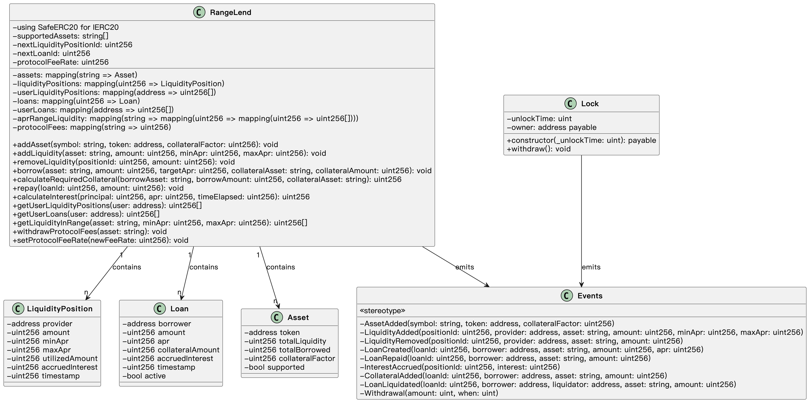

# RangeLend - 基于APR区间的创新借贷协议

RangeLend是一个创新的借贷协议，灵感来源于Uniswap V3的集中流动性概念。在本协议中，贷方可以在特定的年化收益率（APR）区间内提供流动性，从而获得更可预测的回报。

## 项目结构

```
FlowLend/
├── backend/ - Express后端，提供API服务
├── contract/ - Solidity智能合约
└── frontend/ - Next.js前端应用
```

## 核心功能

- **基于APR区间的流动性提供**：贷方可以设定自己愿意接受的最低和最高APR，只有在这个范围内的借款请求才会使用其流动性
- **精确匹配借款利率**：借款人可以指定期望的APR，系统会自动匹配相应区间的流动性
- **抵押借款机制**：支持抵押品管理和流动性风险控制
- **多资产支持**：支持USDC、USDT、DAI和ETH等多种资产

## 技术栈

- **前端**：Next.js、TailwindCSS、wagmi、viem、ethers.js、RainbowKit
- **后端**：Express、MongoDB
- **智能合约**：Solidity、Hardhat

## 快速开始

### 前端

```bash
cd frontend
npm install
npm run dev
```

### 后端

```bash
cd backend
npm install
npm run dev
```

### 智能合约

```bash
cd contract
npm install
npx hardhat node  # 启动本地测试网络
npx hardhat run scripts/deploy.js --network localhost  # 部署合约
```

## 所有部署在Monad Testnet的合约地址

USDC 代币部署在: 0x129FA4D3F41Ee5439C711575779dfe1062551812(用途: 测试代币)
USDT 代币部署在: 0xfD54fEf4a9359aAC37Fc61F44762852c7f4492e0(用途: 测试代币)
DAI 代币部署在: 0x97200232caF5E062D0b916d398eBBCD2e636b9F3(用途: 测试代币)
WETH 代币部署在: 0xBd3acBCB193a4BD9d499DdF70BC7CA1f0ab54979(用途: 测试代币)
MONAD 代币部署在: 0x58B007DAB46709D04E8010F481a1dE9f0f6d36bD(用途: 测试代币)
RangeLend 协议部署在: 0xd8Ab620d9408CdF68A7617c677F51BD3a37092e1(用途: 主协议合约，管理借贷功能)

## RangeLend合约类图


## 如何使用

1. **提供流动性**：用户可以选择一个资产以及他们希望的APR区间来提供流动性
2. **借款**：用户可以选择要借的资产，以及他们愿意支付的APR，并提供抵押品
3. **还款**：用户可以随时偿还他们的借款，并取回抵押品
4. **管理头寸**：用户可以在仪表盘中查看和管理他们的流动性头寸和借款
